# Docker Swarm
## Install Virtual Machine (Virtualbox) :
`sudo apt-get install virtualbox`

## Install docker-machine :
```
sudo curl -L https://github.com/docker/machine/releases/download/v0.10.0/docker-machine-`uname -s`-`uname -m` >/tmp/docker-machine &&
  chmod +x /tmp/docker-machine &&
  sudo cp /tmp/docker-machine /usr/local/bin/docker-machine
  ```
## Create a machine
~~~bash
sudo docker-machine create `nama node`
~~~
Jika ingin lebih spesifik dalam membuat node, misal custome memory dan hdd bisa menggunakan perintah di bawah ini :
~~~bash
docker-machine create --driver virtualbox --virtualbox-memory "256" --virtualbox-disk-size "1000" `nama node`
~~~

Kemudian cek docker-machine dengan cara `docker-machine ls`
<p align="center">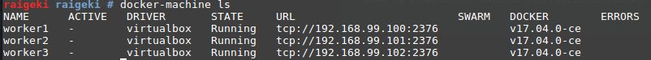<br>Gambar 1</p>

## Join Machine
Join digunakan untuk menggabungkan beberapa node dan salah satunya dijadikan leader/manager

### Konfigurasi salah satu node untuk dijadikan leader/manager

```
docker swarm init --advertise-addr 192.168.99.1
```

Ip 192.168.99.11 saya ambil dari ip virtualbox
<p align="center">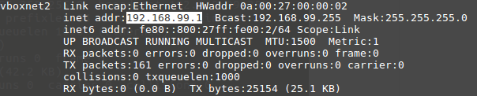<br>Gambar 2</p>

Inisialisasi :
<p align="center">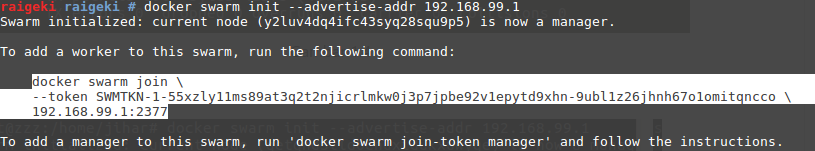<br>Gambar 3</p>

Pada Gambar 3 bagian yang saya blok maksudnya adalah perintah untuk join ke node tersebut (leader/manager). Dimana isi dari perintah itu adalah Perintah join, token, dan IP dari node tersebut. Kita bisa mengcopy semuanya agar lebih mudah.

### Konfigurasi node yang akan dijadikan sebagai worker

- Masuk kedalam node worker yang akan di join ke node manager dengan perintah : `docker-machine ssh nama_node`
<p align="center">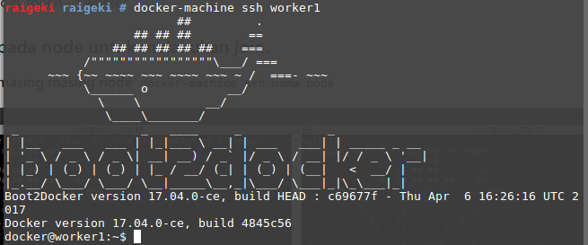<br>Gambar 4</p>

- Kemudian pastekan perintah join yang ada di node manager tadi

<p align="center">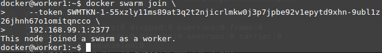<br>Gambar 5</p>

- Cek status node untuk mengetahui mana leader dan mana worker yang digunakan dengan menggunakan perintah : `docker node ls`

<p align="center">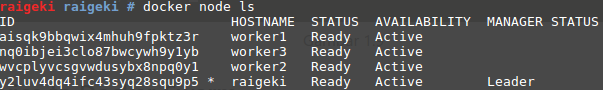<br>Gambar 6</p>

## Deploy Service
- Pada kesempatan kali ini saya akan mendeploy service wordpress dengan docker-compose.

- Perlu diingin jika ingin menjelaskan service docker-compose dalam docker swarm minimal docker-compose.yml nya versi 3.0.

- Jika docker-compose untuk wordpress sudah ada dan versi dalam docker-compose.yml sudah minimal 3.0 maka selanjutnya adalah menjalankan service untuk docker-compose tersebut dengan cara :
 ```
 docker stack deploy --compose-file docker-compose.yml nama_service
 ```
 <p align="center">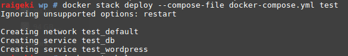<br>Gambar 7</p>

- Kemudian untuk mengecek service docker-compose pada docker swarm yang berjalan dengan perintah `docker stack ls`
<p align="center">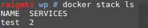<br>Gambar 8</p>

- Cek dengan menjalankan service pada setiap node
<p align="center">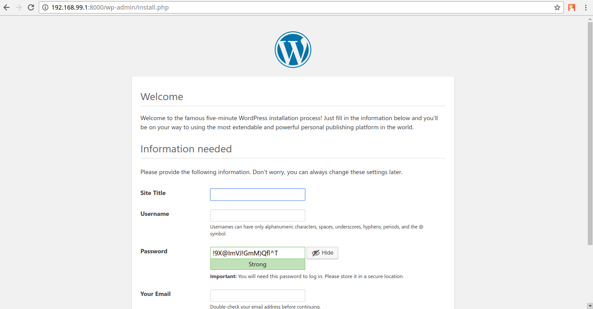<br>Leader</p>
<p align="center"><br>Worker1</p>
<p align="center">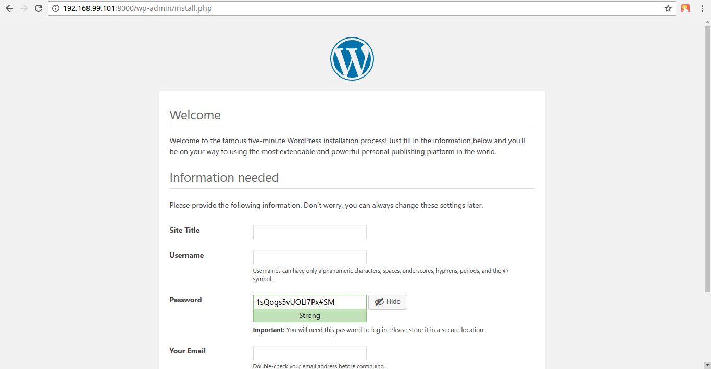<br>Worker2</p>
<p align="center">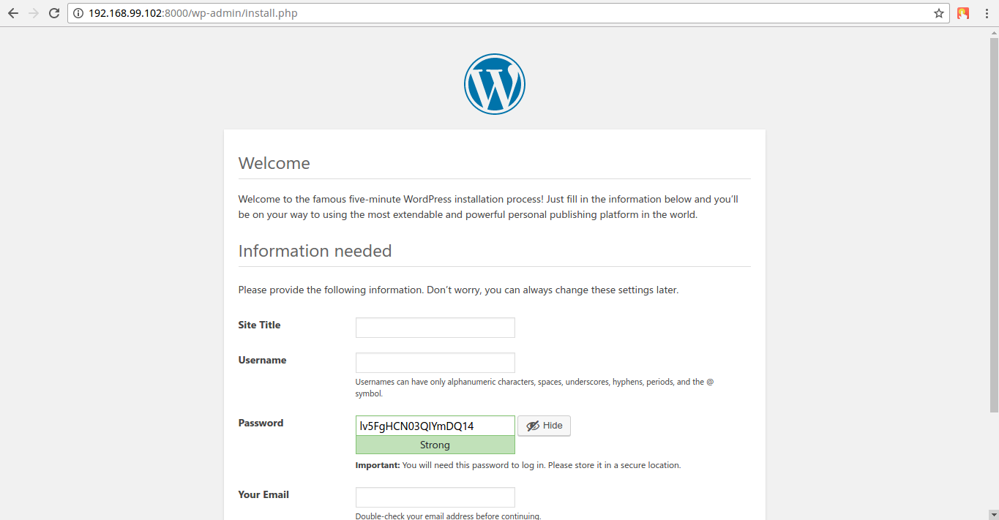<br>Worker3</p>

## Docker Scale
- Docker scale digunakan untuk membagi kinerja service ke node-node yang digunakan dan tergantu berapa pembagian scalenya.
- Cara melakukan scale dengan menggunakan perintah `service scale nama_scale=jumlah pembagian scale`. Kemudian untuk mengeceknya menggunakan perintah `docker service ps nama_service`

<p align="center">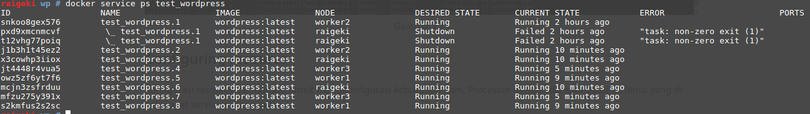<br>Gambar 9</p>
